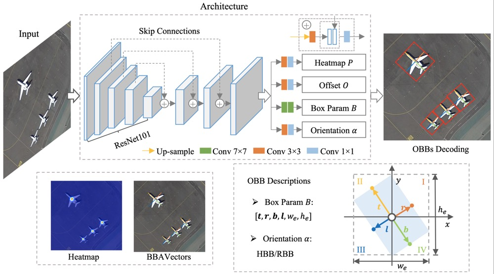

# BBAVectors-Oriented-Object-Detection
[WACV2021] Oriented Object Detection in Aerial Images with Box Boundary-Aware Vectors ([arXiv](https://arxiv.org/pdf/2008.07043.pdf))

Please cite the article in your publications if it helps your research:

	@inproceedings{yi2021wacv,
	  title={Oriented Object Detection in Aerial Images with Box Boundary-Aware Vectors},
	  author={Yi, Jingru and Wu, Pengxiang and Liu, Bo and Huang, Qiaoying and Qu, Hui and Metaxas, Dimitris N},
	  booktitle={WACV},
	  year={2021},
	}


# Introduction

Oriented object detection in aerial images is a challenging task as the objects in aerial images are displayed in arbitrary directions and are usually densely packed. Current oriented object detection methods mainly rely on two-stage anchor-based detectors. However, the anchor-based detectors typically suffer from a severe imbalance issue between the positive and negative anchor boxes. To address this issue, in this work we extend the horizontal keypoint-based object detector to the oriented object detection task. In particular, we first detect the center keypoints of the objects, based on which we then regress the box boundary-aware vectors (BBAVectors) to capture the oriented bounding boxes. The box boundary-aware vectors are distributed in the four quadrants of a Cartesian coordinate system for all arbitrarily oriented objects. To relieve the difficulty of learning the vectors in the corner cases, we further classify the oriented bounding boxes into horizontal and rotational bounding boxes. In the experiment, we show that learning the box boundary-aware vectors is superior to directly predicting the width, height, and angle of an oriented bounding box, as adopted in the baseline method. Besides, the proposed method competes favorably with state-of-the-art methods.

<p align="center">
	
</p>

# Evaluation Results on [DOTA-v1.0](https://captain-whu.github.io/DOTA/evaluation.html)

We evaluate the BBAVectors+rh on 4 RTX6000 GPUs with ```--batch_size 48```, we get higher mAP (74.93) than the reported mAP (72.32) in the paper. We thank the public visitors for their effort. The model weights can be found [here](https://drive.google.com/drive/folders/1a5LirNJ9-jc21JV11WBGqDYKpur95sno?usp=sharing).


```ruby
mAP: 0.7492727335105831
ap of each class: plane:0.8859121197958046, baseball-diamond:0.8483251642688572,
bridge:0.5214374843409882, ground-track-field:0.6560710395759289, small-vehicle:0.7773671634218439,
large-vehicle:0.7427879633964128, ship:0.8804625721887132, tennis-court:0.908816372618596,
basketball-court:0.862399364058993, storage-tank:0.8670730838290734, soccer-ball-field:0.5987801663737911,
roundabout:0.6401450110418495, harbor:0.6698206063852568, swimming-pool:0.7071826121359568,
helicopter:0.672510279226682
```


# Dependencies
Ubuntu 18.04, Python 3.6.10, PyTorch 1.6.0, OpenCV-Python 4.3.0.36 

# How to start

Download and install the DOTA development kit [DOTA_devkit](https://github.com/CAPTAIN-WHU/DOTA_devkit) and put it under datasets folder.

## Train the model
```ruby
python main.py --data_dir dataPath --epochs 80 --batch_size 16 --dataset dota --phase train
```

## Test the model
```ruby
python main.py --data_dir dataPath --epochs 80 --batch_size 16 --dataset dota --phase test
```


## Evaluate the model
You may adjust the conf_thresh to get a better mAP
```ruby
python main.py --data_dir dataPath --epochs 80 --conf_thresh 0.1 --batch_size 16 --dataset dota --phase eval
```
